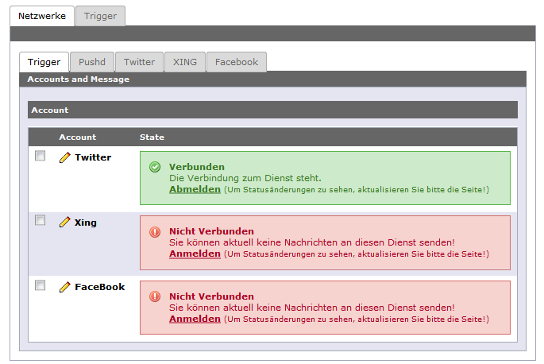

t3socials
=======

What does it do?
----------------

Die Extension verschickt Nachrichten in soziale Netzwerke. Dabei verfolgt sie einen sehr generischen Ansatz, der es ermöglicht, sowohl weitere Netzwerke zu integrieren, als auch weitere Nachrichten-Quellen einzurichten. Derzeit gibt es Anbindungen an Facebook, Twitter, XING, sowie eine Integration von pushd zum einfachen Versand von Push Notifications an Smartphones. Neben der automatischen Generierung von Nachrichten, verfügt die Extension auch über ein Backend-Modul zum manuellen Versand von Nachrichten.

Screenshots
-----------

Die Screenshots zeigen das Backend-Modul von T3 SOCIALS:

[UsersManual](Documentation/UsersManual/Index.md)

[DeveloperManual](Documentation/DeveloperManual/Index.md)

[KnownProblems](Documentation/KnownProblems/Index.md)

[ChangeLog](Documentation/ChangeLog/Index.md)
